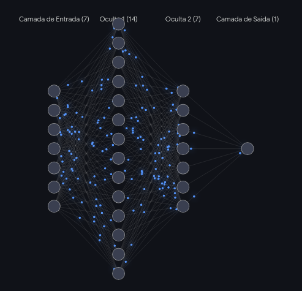

# Lobusco

#### 1. `sizes` (A Arquitetura da Rede)
```json
"sizes": [7, 16, 8, 2]
```

Define a topologia (o formato) da rede neural. Ela é dividida em camadas de "neurônios":

##### 7 (Camada de Entrada): Recebe os dados.

Como analisamos as últimas 7 letras de um nome, temos 7 portas de entrada.

##### 16 e 8 (Camadas Ocultas): Onde acontece o "Deep Learning".

É aqui que a rede processa padrões complexos, como combinações específicas de vogais e consoantes típicas do português.

##### 2 (Camada de Saída): O resultado final.
Representa as duas probabilidades (Masculino ou Feminino).

#### 2. layers (O Aprendizado / Memória)

É o maior bloco do arquivo. Contém a matemática pura que a rede aprendeu. A primeira camada (entrada) é vazia, mas as camadas seguintes contêm dezenas de objetos com duas chaves principais:

##### weights (Pesos)
Representam a "força" da conexão entre um neurônio e outro. Se uma determinada terminação de nome (ex: "son") tem forte relação com o gênero masculino, o "peso" dessa conexão será um número positivo alto.

##### bias (Viés)
É a inclinação natural daquele neurônio para disparar. Funciona como o "instinto" ou a "intuição" basal da rede antes mesmo de receber a soma dos pesos.

#### 3. activation (A Função de Ativação)

```JSON
"activation": "sigmoid"
```

É a fórmula matemática usada para decidir se um neurônio vai "acender" ou não. A função Sigmoide é perfeita para o nosso caso porque ela pega qualquer valor numérico resultante do cálculo de pesos/vieses e o esmaga para um intervalo seguro entre 0 e 1. É graças a ela que conseguimos converter o resultado em uma porcentagem de certeza (ex: 0.85 = 85%).

#### 4. outputLookup (Mapeamento de Saída)

```JSON
"outputLookup": true
```

Uma facilidade do brain.js. Em vez da rede nos devolver um array numérico puro (ex: [0.12, 0.98]), este mapeamento ensina o modelo a nomear as saídas para chaves legíveis por humanos na última camada, entregando o resultado já mastigado nos objetos "male" e "female".

#### 5. trainOpts (Histórico de Treinamento)

Guarda as configurações hiperparamétricas usadas no laboratório quando este modelo foi treinado. É útil para auditoria e para saber como o aprendizado foi configurado:

##### iterations:
O número máximo de épocas (repetições) que a rede rodou estudando a base de dados.

##### learningRate:
A "taxa de aprendizado". Define o quão agressivamente a rede alterou seus próprios pesos a cada erro cometido durante o treino.

##### errorThresh:
A margem de erro aceitável. Se o erro global da rede caiu abaixo deste número, ela parou de treinar por já se considerar "inteligente o suficiente".
